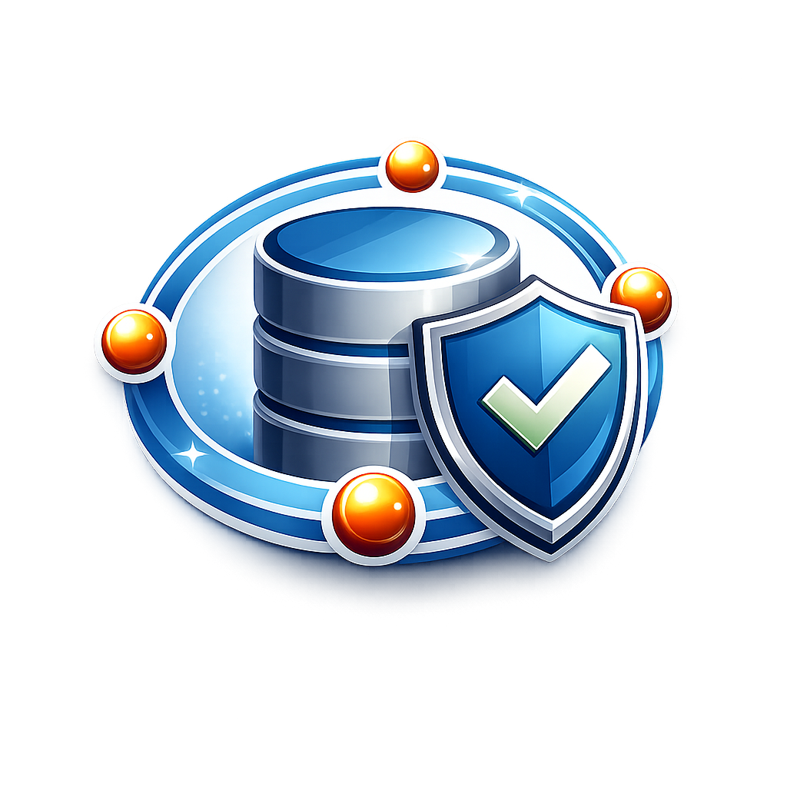

# Neemle Storage Service (Rust)



Self-hosted, single-site object storage with an S3-compatible API, unified admin/console API, and web UI.

## Source Of Truth

- Business behavior and use cases: `functional.md`
- Extended architecture details: `docs/functional-description.md`
- Problem-to-solution usage mapping: `docs/usage.md`

If `README.md` and `functional.md` differ, follow `functional.md`.

## Prerequisites

- Docker + Docker Compose v2
- Optional: Node.js 24+ (only for local UI development)
- Optional: AWS CLI (for manual S3 checks)

## Quick Start

1. Create local env file and review strong values:

```bash
cp .env.dist .env
```

- `NSS_ADMIN_BOOTSTRAP_PASSWORD`
- `NSS_ADMIN_BOOTSTRAP_FORCE_PASSWORD` (set `true` for deterministic local demo logins on reused DB)
- `NSS_AUTH_MODE` (`internal`, `oidc`, `oauth2`, or `saml2`)
- OIDC-compatible values when `NSS_AUTH_MODE` is `oidc`, `oauth2`, or `saml2`:
  - `NSS_OIDC_ISSUER_URL`
  - `NSS_OIDC_CLIENT_ID`
  - `NSS_OIDC_REDIRECT_URL`
  - optional `NSS_OIDC_CLIENT_SECRET`
- `NSS_SECRET_ENCRYPTION_KEY_BASE64` (32-byte base64)
- `NSS_JWT_SIGNING_KEY_BASE64` (32-byte base64, optional but recommended)
- `NSS_CHUNK_ENCRYPTION_ENABLED` (`true` recommended)
- `NSS_CHUNK_ENCRYPTION_ACTIVE_KEY_ID` (for example `default`)
- `NSS_CHUNK_ENCRYPTION_ALLOW_PLAINTEXT_READ` (`false` after migration)
- `NSS_CHUNK_ENCRYPTION_KEY_BASE64` (optional dedicated active chunk key, 32-byte base64)
- `NSS_CHUNK_ENCRYPTION_KEYS` (optional keyring: `key_id:base64,key_id2:base64`)
- `NSS_INTERNAL_SHARED_TOKEN`
- `NSS_CORS_ALLOW_ORIGINS` (explicit origins when `NSS_INSECURE_DEV=false`)

Generate an encryption key when needed:

```bash
openssl rand -base64 32
```

2. Start services:

```bash
docker compose up --build
```

3. Access endpoints:
- Unified UI + API: `http://localhost:9001`
- S3 API: `http://localhost:9000`
- Replica 1 S3 API (read): `http://localhost:9004`
- Replica 2 S3 API (read): `http://localhost:9005`
- Master metrics: `http://localhost:9100/metrics`
- Prometheus: `http://localhost:9090`
- Grafana: `http://localhost:3000`
- Loki API: `http://localhost:3100`

4. Sign in as bootstrap admin, create a user, then create an access key.
   - In external auth mode (`oidc`, `oauth2`, `saml2`), use `Continue with external identity` on login.

5. Validate S3 using AWS CLI:

```bash
aws s3 mb s3://my-bucket --endpoint-url http://localhost:9000 --region us-east-1
aws s3 cp ./file.txt s3://my-bucket/file.txt --endpoint-url http://localhost:9000 --region us-east-1
aws s3 ls s3://my-bucket --endpoint-url http://localhost:9000 --region us-east-1
```

## Test Suites (Fail-Fast Order)

Run in this order:

```bash
./scripts/run-tests.sh all
```

Notes:
- Unit and integration suites enforce 100% coverage thresholds through `cargo llvm-cov`.
- UI unit and UI integration suites run with Vitest in Docker via `node:24-alpine`.
- All runner logs and artifacts are collected under `test-results/*`.
- Playwright UI runners execute requested projects in one run and fail unless every requested project appears in
  the report.
- Playwright HTML report and videos are copied to:
  - `test-results/ui-base/test-results/*` and `test-results/ui-base/playwright-report/*`
  - `test-results/ui-e2e/test-results/*` and `test-results/ui-e2e/playwright-report/*`
  - `test-results/ui-tests/test-results/*` and `test-results/ui-tests/playwright-report/*`
    (when base+ui projects run together)
  - `test-results/production-tests/test-results/*` and
    `test-results/production-tests/playwright-report/*`
- Dockerized Playwright stages fail unless:
  - `.webm` artifacts exist
  - video count is at least the executed test count
  - executed test count is greater than `3` (prevents base-only accidental runs for full UI stages)
- Runtime and production suites execute against containerized runtime/prod images.

### Targeted Stage Runs

```bash
./scripts/run-tests.sh api-unit
./scripts/run-tests.sh api-integration
./scripts/run-tests.sh api-curl
./scripts/run-tests.sh enc
./scripts/run-tests.sh ui-base ui-e2e
NSS_PLAYWRIGHT_PROJECTS="base ui" ./scripts/ui-tests.sh
```

Supported stage keys:
- `all`, `api-unit`, `api-integration`, `api-curl`, `api-it`
- `ui-unit`, `ui-integration`, `ui-base`, `ui-e2e`
- `cluster`, `runtime`, `production`, `security`, `memcheck`, `enc`

## Security Audit Policy

Run Rust dependency advisories check with repository policy:

```bash
./scripts/security-audit.sh
```

Current exception policy is documented in `audit.toml` and is scoped to:
- `RUSTSEC-2023-0071` (transitive `sqlx-mysql` metadata path; no fixed upstream release available).

## Memory Leak Check (Dockerized)

Run valgrind leak checks in a Dockerized toolchain:

```bash
./scripts/memory-leak-check.sh
```

Outputs:
- `test-results/memcheck/valgrind.log`
- `test-results/memcheck/app.log`
- `test-results/memcheck/summary.txt`

Policy:
- Fails when any of these is non-zero:
  - `definitely_lost_bytes`
  - `indirectly_lost_bytes`
  - `possibly_lost_bytes`
- CI runs this check in Stage `2C - Memcheck` and uploads artifacts for review.

## Distribution Build

Build UI + cross-platform binaries in Docker:

```bash
npm run build:dist -- all
```

Artifacts are placed under `dist/`:
- `dist/ui`
- `dist/linux-amd64/nss`
- `dist/linux-aarch64/nss`
- `dist/linux-musl-x64/nss`
- `dist/windows-x64/nss.exe`
- `dist/windows-aarch64/nss.exe`
- `dist/mac-x64/nss`
- `dist/mac-aarch64/nss`

Release binaries are built with symbol stripping enabled (`[profile.release].strip = "symbols"`),
which reduces artifact size.

## Production Image Build

Build versioned production image tags (version + `latest`):

```bash
./scripts/build-production-image.sh a/b 0.1.0
./scripts/build-production-image.sh a/b-replica 0.1.0 replica
```

Behavior:
- Builds `a/b:0.1.0` and `a/b:latest`
- Passes `NSS_APP_VERSION=0.1.0` at build time
- Build logs are written to `test-results/build-image/*`

## Distroless And Static Runtime Verification

Verify runtime image hardening locally:

```bash
./scripts/verify-distroless.sh nss-local master-check master
./scripts/verify-distroless.sh nss-local replica-check replica
```

What this enforces:
- Runtime image is distroless (no `/bin/sh`).
- Binary is runnable (`/app/nss --version`).
- Binary is statically linked (`ldd` reports static / not dynamic executable).

CI runs this verification before Stage 1 tests.

## Enterprise Gate (Local)

Run a strict baseline before pushing:

```bash
cargo fmt --all -- --check
cargo clippy --workspace -- -D warnings
./scripts/security-audit.sh
./scripts/run-tests.sh all
```

## Replication And Data Directories

- Replication uses master-issued join tokens plus internal heartbeats so replica liveness is explicit.
- `NSS_REPLICATION_FACTOR` and `NSS_WRITE_QUORUM` control durability/availability tradeoffs.
- Out of the box distributed content delivery: writes stay on master S3 data-plane, while replica S3
  data-plane serves authenticated and presigned read traffic.
- Access keys created on master and presigned URLs generated on master are accepted on replica reads.
- For presigned URL compatibility across master/replicas, expose a shared S3 public host/load balancer and
  route read traffic to replica nodes.
- Node runtime mode supports:
  - `master`: write/control plane.
  - `slave-delivery` (or `delivery`): serves authenticated/presigned read traffic.
  - `slave-backup` (or `backup`): blocks client S3 serving and allows backup-only operation.
  - `slave-volume` (or `volume`): blocks client S3 serving and remains storage-capacity focused.
- `NSS_MODE` accepts `master`, `replica`, and slave aliases (`slave-delivery`, `slave-backup`,
  `slave-volume`). Slave aliases map to replica mode plus matching sub-mode.
- Slave mode is remotely configurable from master admin API and synced by replica heartbeat.
- `NSS_DATA_DIRS` accepts multiple comma-separated paths (for example `/data1,/data2,/data3`).
- Multiple data directories improve disk utilization and reduce hot-spot risk by spreading chunk writes.
- Multi-dir layouts also simplify storage expansion by adding new mount points without changing API behavior.
- Root compose stores temporary local data under:
  - Postgres: `.local-data/pg`
  - Master data: `.local-data/master`
  - Replica data: `.local-data/replicas/replica-1` and `.local-data/replicas/replica-2`

## Chunk Encryption At Rest

- Chunk payloads written under `NSS_DATA_DIRS` are encrypted at rest by default.
- Encrypted chunk files use an authenticated envelope containing key id + nonce + ciphertext.
- If `NSS_CHUNK_ENCRYPTION_KEYS` is unset, NSS uses either:
  - `NSS_CHUNK_ENCRYPTION_KEY_BASE64` (if set), or
  - `NSS_SECRET_ENCRYPTION_KEY_BASE64` as fallback chunk key material.
- Key rotation:
  - Set `NSS_CHUNK_ENCRYPTION_ACTIVE_KEY_ID` to the key id used for new writes.
  - Keep previous key ids in `NSS_CHUNK_ENCRYPTION_KEYS` so older chunks remain readable.
- Migration compatibility:
  - `NSS_CHUNK_ENCRYPTION_ALLOW_PLAINTEXT_READ=true` permits reading legacy plaintext chunks.
  - Set it to `false` after migration to enforce encrypted-only chunk reads.

## Authentication Modes

- `internal` mode:
  - UI login uses local username/password (`/console/v1/login`).
- `oidc`, `oauth2`, and `saml2` modes:
  - UI login redirects to provider (`/console/v1/oidc/start` -> callback `/console/v1/oidc/callback`).
  - NSS validates OIDC ID token (issuer/audience/signature/nonce), creates local session JWT, and maps user profile.
  - Admin privileges are granted when OIDC group claims match `NSS_OIDC_ADMIN_GROUPS`.
  - Password login endpoints are rejected while external auth mode is active.

### Keycloak Setup Example

This example matches local development (`http://localhost:9001`).

1. Create a realm:
   - `nss`
2. Create a client:
   - Client ID: `nss-console`
   - Client protocol: `openid-connect`
   - Enable standard authorization code flow.
   - Keep direct access grants disabled unless explicitly needed.
3. Configure client redirect and origin:
   - Valid redirect URI:
     - `http://localhost:9001/console/v1/oidc/callback`
   - Web origin:
     - `http://localhost:9001`
4. Configure client authentication:
   - If client authentication is off (public client), keep `NSS_OIDC_CLIENT_SECRET` empty.
   - If client authentication is on (confidential client), copy Keycloak client secret into
     `NSS_OIDC_CLIENT_SECRET`.
5. Configure admin role/group mapping:
   - Create realm role `nss-admin`.
   - Assign it to users that should have NSS admin access.
   - Set `NSS_OIDC_GROUPS_CLAIM` to the claim path containing roles/groups.
   - If using Keycloak realm roles via token claim `realm_access.roles`, set:
     - `NSS_OIDC_GROUPS_CLAIM=realm_access.roles`
     - `NSS_OIDC_ADMIN_GROUPS=nss-admin`

Recommended local `.env` values for Keycloak:

```env
NSS_AUTH_MODE=oidc
NSS_OIDC_ISSUER_URL=http://localhost:8080/realms/nss
NSS_OIDC_CLIENT_ID=nss-console
NSS_OIDC_CLIENT_SECRET=
NSS_OIDC_REDIRECT_URL=http://localhost:9001/console/v1/oidc/callback
NSS_OIDC_SCOPES=openid profile email
NSS_OIDC_AUDIENCE=nss-console
NSS_OIDC_USERNAME_CLAIM=preferred_username
NSS_OIDC_DISPLAY_NAME_CLAIM=name
NSS_OIDC_GROUPS_CLAIM=realm_access.roles
NSS_OIDC_ADMIN_GROUPS=nss-admin
```

## Observability Demo Stack

- Root compose includes one master, two replicas, Prometheus, Loki, Promtail, Grafana, and demo load traffic.
- Native node metrics are scraped from `/metrics` on master and both replicas.
- Loki stores logs in Neemle Storage Service bucket `NSS_OBS_LOKI_BUCKET`.
- Thanos sidecar uploads Prometheus TSDB blocks to Neemle Storage Service bucket
  `NSS_OBS_PROM_BUCKET`.
- Grafana preprovisions:
  - `Neemle Storage Service Overview` dashboard
  - `Neemle Storage Service Logs` dashboard
- To view dashboards in local dev:
  - Open `http://localhost:3000`
  - Login with `GRAFANA_ADMIN_USER` / `GRAFANA_ADMIN_PASSWORD` from `.env`
    (defaults: `admin` / `admin`)
  - Open dashboards from `Dashboards -> Neemle Demo` or use direct links:
    - `http://localhost:3000/d/nss-overview`
    - `http://localhost:3000/d/nss-logs`

## Snapshots And Backups

- Bucket snapshots:
  - Scheduled triggers: `hourly`, `daily`, `weekly`, `monthly`, `on_create_change`
  - On-demand trigger: `on_demand`
  - Snapshot restore creates a new bucket from immutable snapshot metadata/content mappings.
- Backup policies:
  - Types: `full`, `incremental`, `differential`
  - Schedules: `hourly`, `daily`, `weekly`, `monthly`, `on_demand`
  - Strategies: `3-2-1`, `3-2-1-1-0`, `4-3-2`
  - Scope: `master` or `slave` (`replica` accepted as alias; slave scope requires node assignment and
    `slave-backup` runtime mode on that node).
- Backup targets:
  - Backups are written to WORM-enabled backup buckets (`is_worm=true`).
  - WORM buckets are write-once: first object create is allowed, overwrite/delete mutations are blocked.
  - Remote target descriptors (S3/Glacier/SFTP/other) are validated on policy create/update.
  - Connection tests are available:
    - API: `POST /admin/v1/storage/backup-targets/test`
    - UI: `Admin -> Storage protection -> Test remote targets`
- Export:
- Backup run export supports `tar` and `tar.gz`.

### Admin UI Help Hints

- The Admin -> Storage protection section now includes inline help hints for:
  - backup strategy selection (`3-2-1`, `3-2-1-1-0`, `4-3-2`)
  - WORM backup bucket behavior
  - snapshot/restore workflow expectations
  - node mode operational intent (`master`, `slave-delivery`, `slave-backup`, `slave-volume`)
- Storage protection controls are split into operator-safe parts:
  - Nodes
  - Buckets
  - Snapshots
  - Backups
- External target JSON has a guidance note plus example loader (`Show example`) in the UI.
  - Example payload includes `s3` and `sftp` gateway target templates.
  - `tar.gz` export uses maximum gzip compression.

## Runtime Image Profile

- Runtime images (`deploy/Dockerfile.master`, `deploy/Dockerfile.replica`) use distroless base
  `gcr.io/distroless/cc-debian12`.
- Result: smaller runtime image surface (no shell/package manager) and lower support/security footprint.

## Runtime UI Override

To override API base without rebuilding (when serving from `NSS_UI_DIR`), replace:

- `/ui/assets/runtime-config.js`

Example:

```js
window.__API_BASE__ = 'https://api.example.com';
```

Legacy globals `window.__CONSOLE_API_BASE__` and `window.__ADMIN_API_BASE__` are still supported.

## Console UI Structure And Compression

- UI source is split into pages/components under `web/console-ui/src/app/pages` and
  `web/console-ui/src/app/components` to keep auth, header/settings, and operations UI maintainable.
- `npm run build:embed` builds production UI and generates `.gz` static assets with max gzip compression.
- Embedded/static serving prefers gzipped variants when clients send `Accept-Encoding: gzip`.

## CI/CD (GitHub Actions)

- Every push and pull request runs build + full fail-fast test stages.
- Every push and pull request also runs Rust advisory audit via `./scripts/security-audit.sh`.
- Tag pushes (for example `v1.2.3`) also build release binaries and publish GitHub release assets.
- Release assets include per-platform archives and checksums.

## Push Checklist

Before pushing:

1. Ensure `.env` has safe local defaults (no real secrets).
2. Run the fail-fast test order locally when possible.
3. Confirm docs (`README.md`, `functional.md`) match implemented behavior.
4. Push branch and verify GitHub Actions passes.

## Documentation

- Business and use cases: `functional.md`
- Functional overview: `docs/functional-description.md`
- Backup and restore manual: `docs/backup-restore-manual.md`
- Installation: `docs/installation-guide.md`
- Configuration: `docs/configuration-guide.md`
- AI/agent onboarding: `docs/ai-agent-guide.md`
- Traefik deployment example: `docs/traefik/stack.yml` + `docs/traefik/stack.env`
