# Neemle Storage Service Specification

This document is the business source of truth for behavior and acceptance.

## 1) What The System Does

Neemle Storage Service is a self-hosted, single-site, S3-compatible object storage platform with:
- S3-compatible data plane
- Unified admin/console API + web UI
- Master/replica cluster controls
- Snapshot/backup operations
- Optional observability demo topology

## 2) Business Value

- Provide a MinIO-class private storage platform without cloud lock-in.
- Keep control-plane operations in one UI/API surface.
- Preserve durability with replication, checksums, and repair workflows.
- Keep deployment deterministic via Docker-first local/CI flows.

## 3) High-Level Architecture

- Master node: write/data-plane control and admin APIs.
- Replica nodes: read-delivery and storage roles by mode.
- Postgres: metadata source of truth.
- Redis/RabbitMQ: optional acceleration/events.
- Web UI: embedded static app served by backend.

## 4) Business Rules (BR-###)

- `BR-001`: Deployment scope is single-site only.
- `BR-002`: `NSS_SECRET_ENCRYPTION_KEY_BASE64` must decode to 32 bytes.
- `BR-003`: `NSS_AUTH_MODE` must be one of `internal|oidc|oauth2|saml2`.
- `BR-004`: SigV4 is mandatory for S3 auth flows.
- `BR-005`: Bootstrap admin credentials must exist and be valid at startup.
- `BR-006`: In non-dev mode, insecure defaults are rejected.
- `BR-007`: Replicas must present valid join tokens.
- `BR-008`: Master is the write endpoint for client data-plane writes.
- `BR-009`: `slave-delivery` can serve reads; `slave-backup` and `slave-volume` cannot.
- `BR-010`: WORM buckets allow first write and block overwrite/delete user mutations.
- `BR-011`: Access keys are encrypted at rest.
- `BR-012`: Chunk payloads are encrypted at rest when encryption is enabled.
- `BR-013`: Chunk envelopes must carry resolvable key IDs.
- `BR-014`: Public-read behavior must match bucket policy; private reads require auth/presign.
- `BR-015`: CORS with credentials requires explicit allowed origins in non-dev mode.

## 5) Workflows (WF-###)

- `WF-001`: Internal username/password login and session lifecycle.
- `WF-002`: Federated auth code redirect/callback login.
- `WF-003`: Access key create/read/disable/delete lifecycle.
- `WF-004`: Bucket/object create/update/list/delete lifecycle.
- `WF-005`: Replica token join, heartbeat, and read-delivery eligibility.
- `WF-006`: Snapshot create/list/restore lifecycle.
- `WF-007`: Backup policy schedule/run/export lifecycle.
- `WF-008`: CI fail-fast stage execution `1→7` with artifact collection.

## 6) Use Cases

### Access & Identity

### UC-001: Admin bootstrap and sign-in
Summary: Bootstrap admin can authenticate and access admin controls.
Description: Supports internal and external auth modes with session establishment.
References: `BR-003`, `BR-005`, `BR-006`, `WF-001`, `WF-002`.
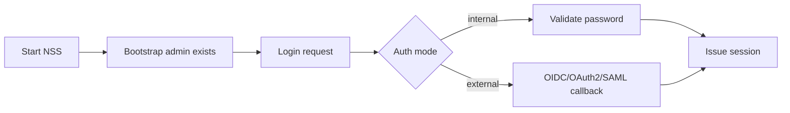
Baseline screenshots:
- `docs/ui-baselines/UC-001/base-desktop-chromium/01-start.png`
Failure modes:
- Invalid credentials or invalid callback state/nonce are rejected.
- Missing/invalid token blocks admin routes.

### UC-002: Console key lifecycle
Summary: Users manage access keys in console.
Description: Key secret is shown once; keys can be disabled and deleted.
References: `BR-011`, `WF-003`.
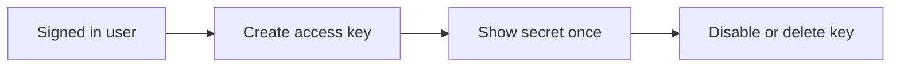
Baseline screenshots:
- `docs/ui-baselines/UC-002/base-desktop-chromium/01-start.png`
Failure modes:
- Invalid session or cross-user operations are rejected.

### UC-015: Federated login (OIDC/OAuth2/SAML2 bridge)
Summary: External identity provider login works end-to-end.
Description: Authorization code callback is validated before local session issuance.
References: `BR-003`, `BR-005`, `WF-002`.
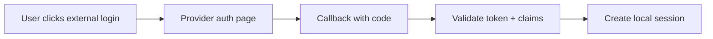
Baseline screenshots:
- `docs/ui-baselines/UC-015/base-desktop-chromium/01-start.png`
Failure modes:
- Missing provider configuration blocks startup/auth flow.
- Invalid state/code/token is rejected.

### Storage & Data Plane

### UC-003: Bucket and object lifecycle
Summary: Users manage buckets and object operations.
Description: Includes create/list/upload/download/rename/delete and metadata edits.
References: `BR-004`, `BR-010`, `BR-014`, `WF-004`.
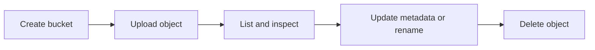
Baseline screenshots:
- `docs/ui-baselines/UC-003/base-desktop-chromium/01-start.png`
Failure modes:
- Invalid bucket/object names are rejected.
- Missing resources return not-found.

### UC-004: Replica join and replication
Summary: Replica joins master and participates in replication.
Description: Admin generates token; replica joins and serves eligible read traffic.
References: `BR-007`, `BR-008`, `BR-009`, `WF-005`.
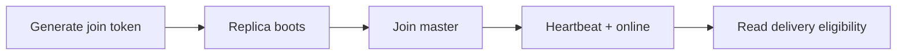
Baseline screenshots:
- `docs/ui-baselines/UC-004/base-desktop-chromium/01-start.png`
Failure modes:
- Invalid/expired join token blocks join.
- Client writes to replica data-plane endpoints are rejected.

### UC-005: Public and presigned URL access
Summary: Public objects and presigned private reads work as designed.
Description: URL behavior aligns with bucket visibility and signature validity.
References: `BR-004`, `BR-014`, `WF-004`.
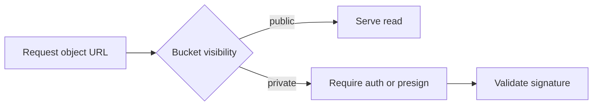
Baseline screenshots:
- `docs/ui-baselines/UC-005/base-desktop-chromium/01-start.png`
Failure modes:
- Expired/invalid signature is rejected.
- Private object without auth/presign is rejected.

### UC-014: Chunk encryption at rest and key rotation
Summary: New chunk writes are encrypted and remain readable after key rotation.
Description: Active key rotates while old keys stay available for decryption.
References: `BR-012`, `BR-013`, `WF-004`.
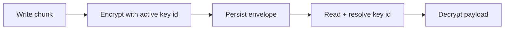
Baseline screenshots:
- `docs/ui-baselines/UC-014/base-desktop-chromium/01-start.png`
Failure modes:
- Unknown key ID rejects read.
- Missing active key blocks startup/runtime init.

### Operations & Governance

### UC-006: CI/CD delivery contract
Summary: CI runs fail-fast stages in required order.
Description: Stage gating stops on first failure; tag builds publish release artifacts.
References: `WF-008`.
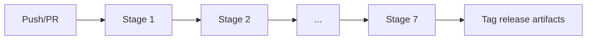
Baseline screenshots:
- `docs/ui-baselines/UC-006/base-desktop-chromium/01-start.png`
Failure modes:
- Any failed stage blocks downstream stages.

### UC-007: Console UI delivery and rendering contract
Summary: UI bundle renders correctly from embedded assets.
Description: SPA routing fallback and compressed static assets remain functional.
References: `BR-015`.

Baseline screenshots:
- `docs/ui-baselines/UC-007/base-desktop-chromium/01-start.png`
Failure modes:
- Missing static assets return not-found.

### UC-008: Admin audit pagination
Summary: Audit log pagination is server-driven.
Description: Offset/limit navigation supports next/previous pages.
References: `WF-001`.
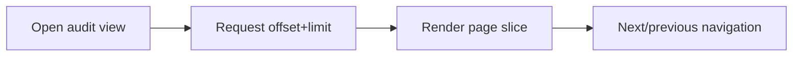
Baseline screenshots:
- `docs/ui-baselines/UC-008/base-desktop-chromium/01-start.png`
Failure modes:
- Invalid paging parameters are rejected.

### UC-009: Bucket snapshot lifecycle and restore
Summary: Snapshot policies and on-demand restore are available.
Description: Immutable snapshot entries can restore into a new bucket.
References: `WF-006`.
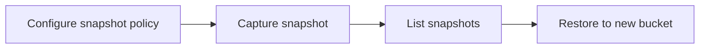
Baseline screenshots:
- `docs/ui-baselines/UC-009/base-desktop-chromium/01-start.png`
Failure modes:
- Missing bucket/snapshot returns not-found.

### UC-010: Backup policy execution and retention
Summary: Backup policies execute and retain runs by policy.
Description: Scheduler and on-demand runs produce archives and retained metadata.
References: `WF-007`.
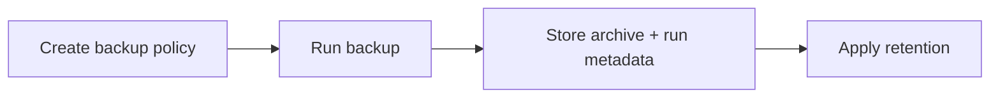
Baseline screenshots:
- `docs/ui-baselines/UC-010/base-desktop-chromium/01-start.png`
Failure modes:
- Invalid schedule/strategy/target is rejected.

### UC-011: Slave node mode control
Summary: Admin remotely controls replica sub-mode.
Description: Delivery/backup/volume modes enforce allowed behavior.
References: `BR-009`, `WF-005`.
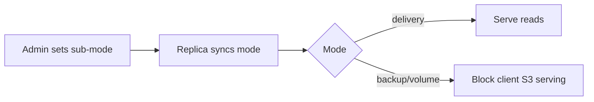
Baseline screenshots:
- `docs/ui-baselines/UC-011/base-desktop-chromium/01-start.png`
Failure modes:
- Unknown node or mode values are rejected.

### UC-012: Backup archive export
Summary: Admin exports backup runs as `tar` or `tar.gz`.
Description: Export outputs deterministic archives for transfer/recovery workflows.
References: `WF-007`.
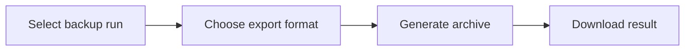
Baseline screenshots:
- `docs/ui-baselines/UC-012/base-desktop-chromium/01-start.png`
Failure modes:
- Invalid export format is rejected.
- Missing backup run returns not-found.

### UC-013: Observability demo stack
Summary: Demo topology boots with metrics/log pipelines.
Description: Master + replicas + Prometheus/Loki/Grafana start with seeded storage buckets.
References: `WF-005`.
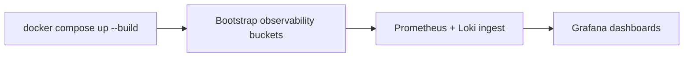
Baseline screenshots:
- `docs/ui-baselines/UC-013/base-desktop-chromium/01-start.png`
Failure modes:
- Bootstrap auth or token seeding failure blocks dependent demo surfaces.
